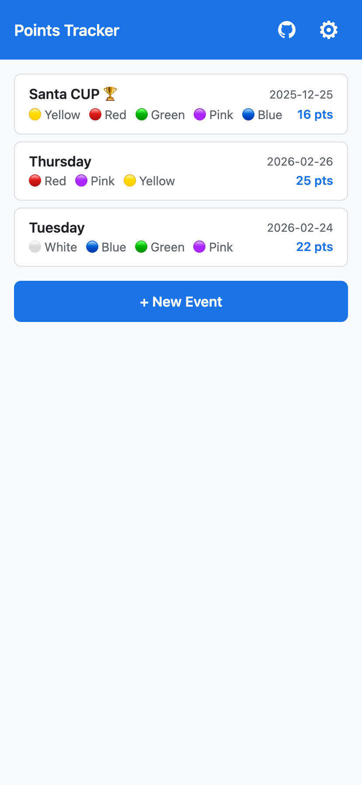
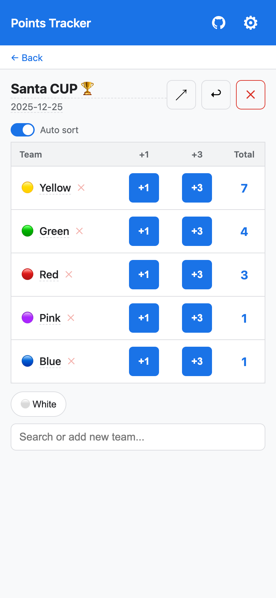
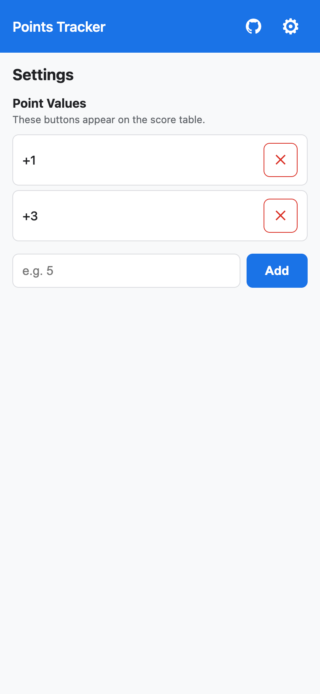

# Sports Points Tracker

A lightweight PWA for tracking team scores during sporting events. Create events, add teams, tap to score — and share results when the game is over.

Built with React, TypeScript, and Vite. Works offline with local storage persistence.

## Screenshots

| Events | Scoring | Settings |
|--------|---------|---------|
|  |  |  |

## Getting Started

```bash
npm install
npm run dev
```

## License

[MIT](LICENSE)
